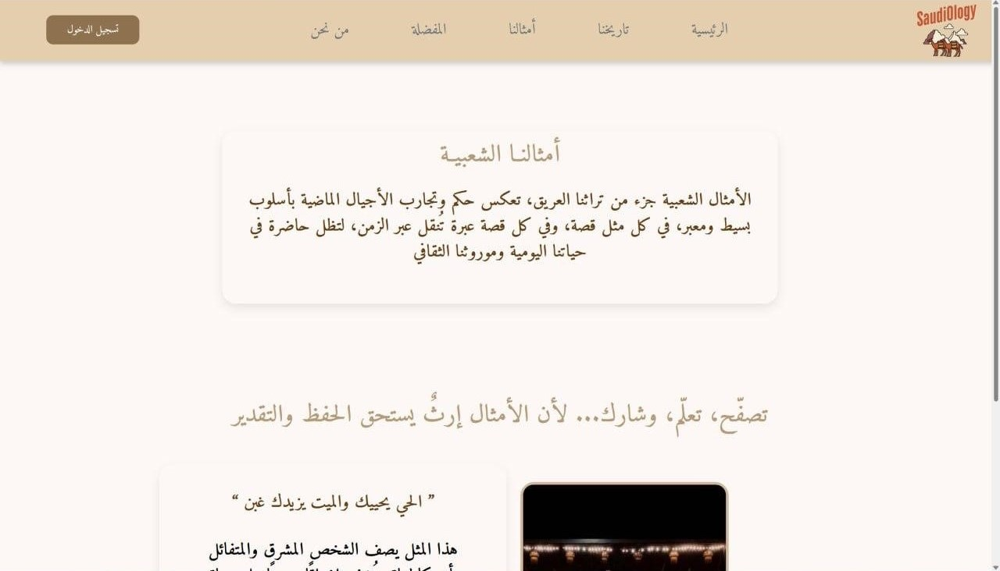

# SaudiOlogy - Interactive Platform to Preserve Saudi Heritage

## Overview
SaudiOlogy is an interactive web platform dedicated to preserving and showcasing the cultural heritage and history of Saudi Arabia. It enables users to explore curated collections of historical stories, traditional proverbs, and cultural landmarks in Arabic.

## What the Project Does
- Presents curated historical stories and archaeological sites.
- Explains the significance and origins of traditional Saudi proverbs.
- Uses interactive maps to locate and explore cultural landmarks.
- Allows users to bookmark their favorite stories.

## Why the Project is Useful
SaudiOlogy serves as a digital gateway to Saudi Arabia’s living history. It helps users, researchers, and culture enthusiasts to connect with the rich heritage of Saudi Arabia and contributes to preserving cultural knowledge for future generations. The platform provides educational content in an accessible and engaging format.

## How Users Can Get Started with the Project
1. Visit the platform and create an account using your email.
2. Log in to access and explore stories, proverbs, and landmarks.
3. Use the interactive map to discover cultural sites.
4. Bookmark your favorite stories for quick access.


## Who Maintains and Contributes to the Project
The project is maintained and developed by:
- Rania Almutairi
- Ola Alasmari
- Elaf Basmair
- Shouq Alsubaie

---

## Features
- Selected historical stories and archaeological sites.
- Popular Saudi proverbs with detailed explanations.
- Interactive map integration using Google Maps.
- Favorites feature for saving stories.


---
## Screenshots

### Home Page


### Proverbs Page


### Proverbs2 Page


### Favorites Page

 
### SignUp Page


### SignIn Page


### aboutUs Page


---
# Getting Started with Create React App

This project was bootstrapped with [Create React App](https://github.com/facebook/create-react-app).

## Available Scripts

In the project directory, you can run:

### `npm start`
Runs the app in the development mode.  
Open [http://localhost:3000](http://localhost:3000) to view it in your browser.  
The page will reload when you make changes. You may also see any lint errors in the console.

### `npm test`
Launches the test runner in the interactive watch mode.  
See the section about [running tests](https://facebook.github.io/create-react-app/docs/running-tests) for more information.

### `npm run build`
Builds the app for production to the `build` folder.  
It correctly bundles React in production mode and optimizes the build for the best performance.  
The build is minified and the filenames include the hashes.  
Your app is ready to be deployed!  
See the section about [deployment](https://facebook.github.io/create-react-app/docs/deployment) for more information.

### `npm run eject`
**Note: this is a one-way operation. Once you `eject`, you can't go back!**  
If you aren't satisfied with the build tool and configuration choices, you can `eject` at any time. This command will remove the single build dependency from your project.  

---

## Installation

1. Clone the repository:
```bash
git clone https://github.com/your-username/audiOlogy.git
